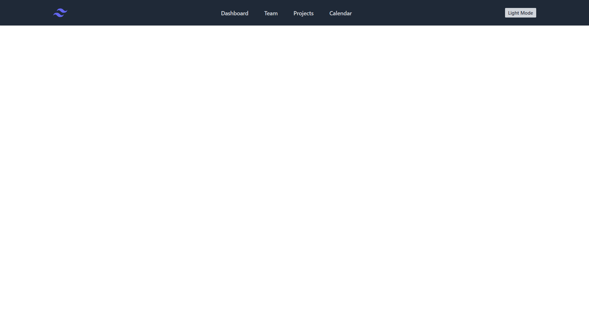
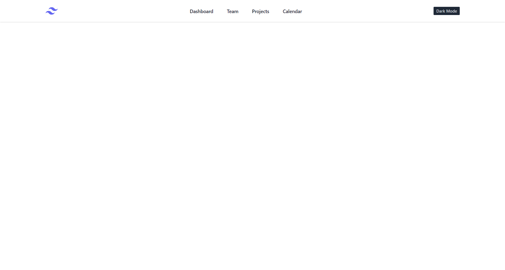

# Tailwind CSS Dark Light Mode

This project is an example of implementing Dark Mode / Light Mode using Tailwind CSS. Dark Mode is a feature that allows users to change the appearance of a website from light to dark mode or vice versa, according to user preferences or lighting situations.

## Features

- Navbar with light/dark mode toggle
- Automatically saves user mode preferences in Local Storage, so when the page is refreshed, the last selected mode is retained.

## Screenshots

